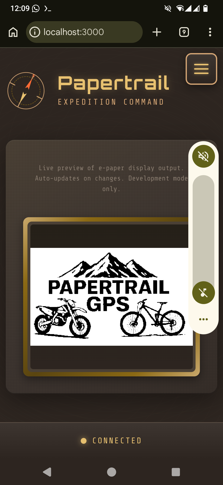
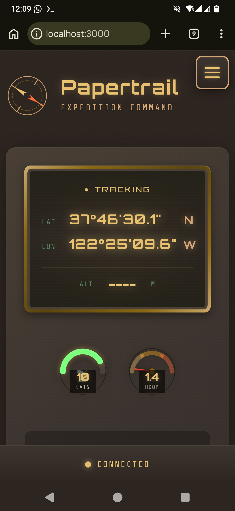
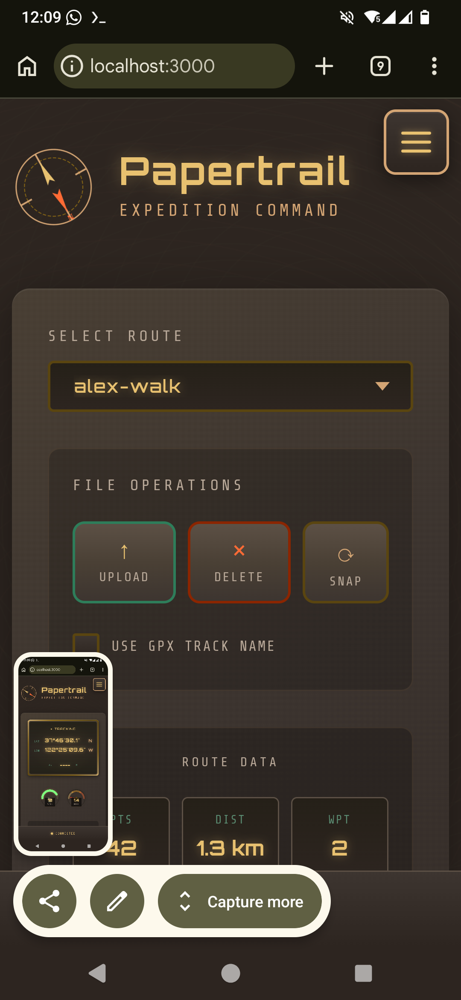
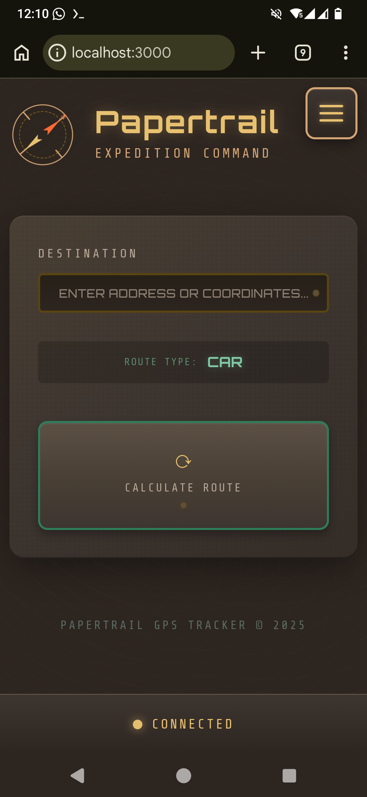
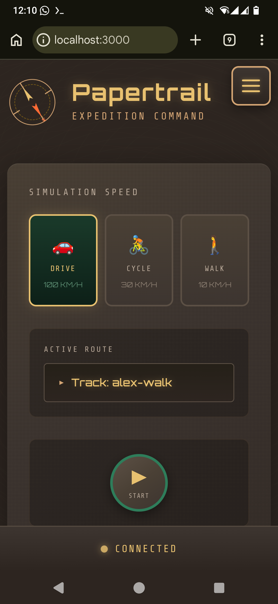
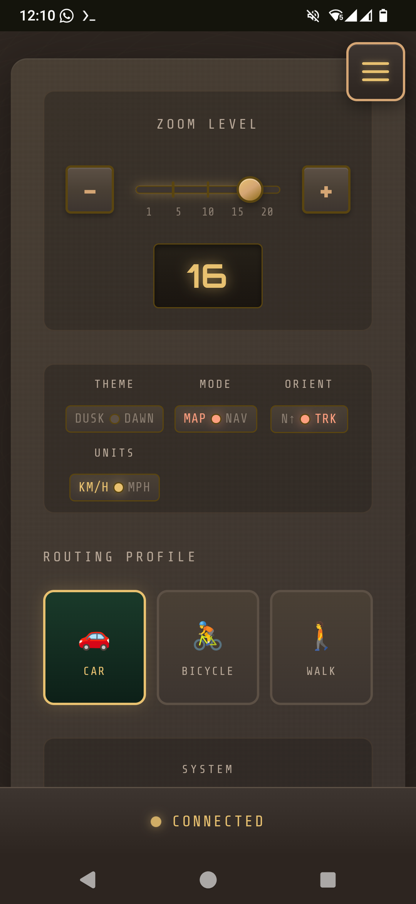
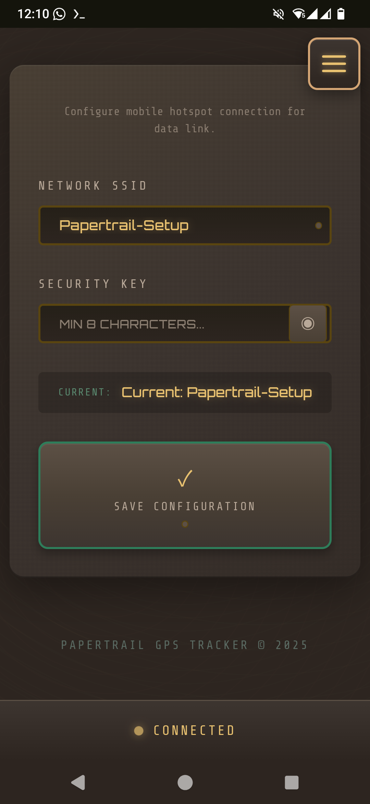
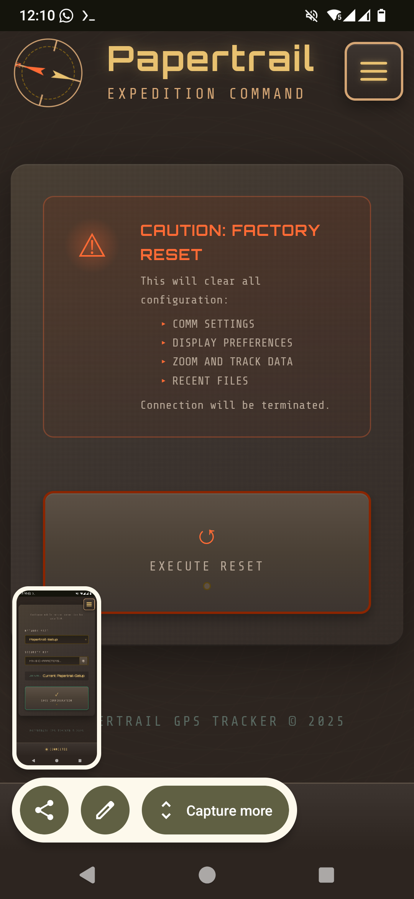
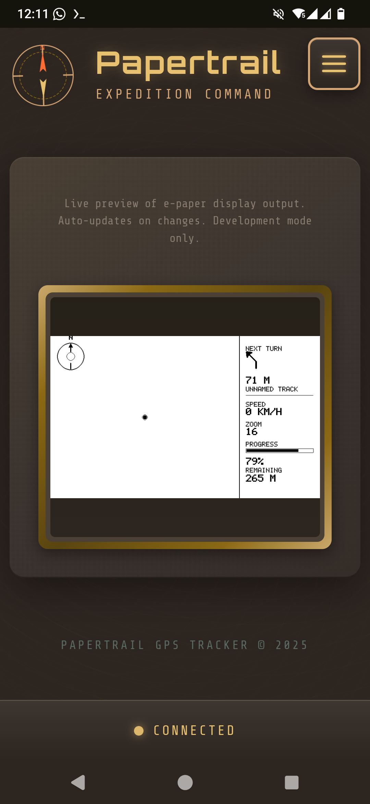

# Papertrail GPS Tracker

A GPS tracker with e-paper display for Raspberry Pi 5, featuring a mobile web interface for control.

https://github.com/user-attachments/assets/401a7059-fb35-43b6-b386-12122479949b

> **[Read the story of how this project was built](article.md)** — 90,000 lines of TypeScript, built with Claude Code on a phone in your pocket.

## Web Interface

<table>
  <tr>
    <td align="center"><br/><b>Dashboard</b><br/>Live e-paper preview</td>
    <td align="center"><br/><b>GPS</b><br/>Real-time position &amp; satellite status</td>
    <td align="center"><br/><b>Track</b><br/>GPX route selection &amp; management</td>
  </tr>
  <tr>
    <td align="center"><br/><b>Drive</b><br/>Destination input &amp; route calculation</td>
    <td align="center"><br/><b>Simulate</b><br/>Replay routes at drive, cycle, or walk speed</td>
    <td align="center"><br/><b>Config</b><br/>Zoom, theme, mode, orientation &amp; routing profile</td>
  </tr>
  <tr>
    <td align="center"><br/><b>WiFi</b><br/>Mobile hotspot pairing</td>
    <td align="center"><br/><b>System</b><br/>Factory reset</td>
    <td align="center"><br/><b>Navigation</b><br/>Turn-by-turn on e-paper display</td>
  </tr>
</table>

## Features

- Real-time GPS tracking
- GPX track visualization on 800x480 e-paper display
- Turn-by-turn navigation with offline route calculation
- Mobile-responsive web interface via WebSocket
- WiFi management with mobile hotspot pairing
- Track simulation for testing and demos

## Quick Start

```bash
# Clone and install
git clone <your-repo> papertrail
cd papertrail
./scripts/install.sh

# Run
sudo systemctl start papertrail

# Access web interface
open http://your-pi-ip:3000
```

## Documentation

| Document | Description |
|----------|-------------|
| [Installation Guide](docs/installation.md) | Hardware requirements, setup, running, troubleshooting |
| [Configuration](docs/configuration.md) | Environment variables, security, CORS |
| [Developer Guide](docs/developer-guide.md) | Architecture, services, testing, adding features |
| [Architecture](docs/architecture.md) | System diagrams and data flows |

## Common Commands

```bash
# Production
sudo systemctl start papertrail
sudo systemctl stop papertrail
sudo systemctl status papertrail
tail -f /var/log/papertrail.log

# Development
npm run dev              # Dev mode with auto-reload
npm test                 # Run tests
npm run build            # Build for production
```

## API Overview

| Endpoint | Description |
|----------|-------------|
| `GET /api/gps/position` | Current GPS position |
| `GET /api/gps/status` | GPS status and satellites |
| `GET /api/map/files` | List available GPX tracks |
| `POST /api/map/active` | Set active track |
| `POST /api/display/update` | Refresh display |
| `GET /api/system/status` | System status |

WebSocket events: `gps:update`, `display:updated`, `drive:update`, `wifi:state`

See [Developer Guide](docs/developer-guide.md) for complete API documentation.

## License

MIT

## Contributing

Contributions welcome! Please ensure tests pass before submitting PRs.

```bash
npm test
npm run lint
```
